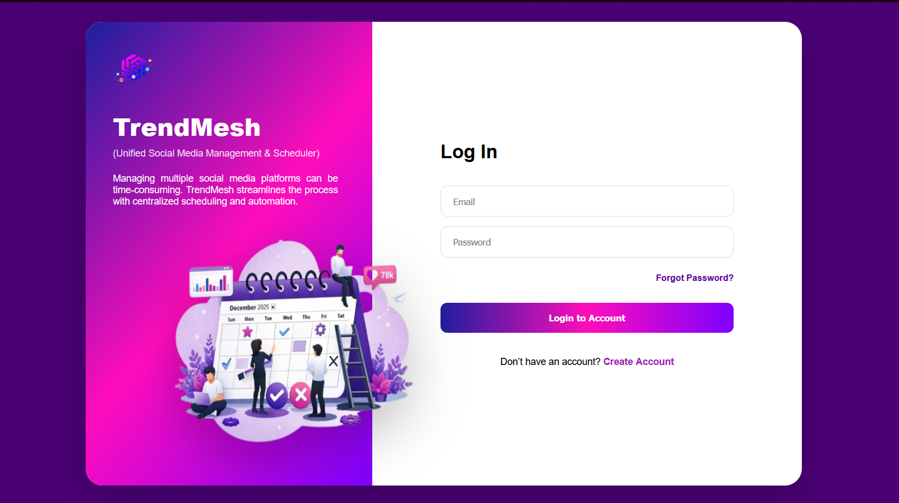
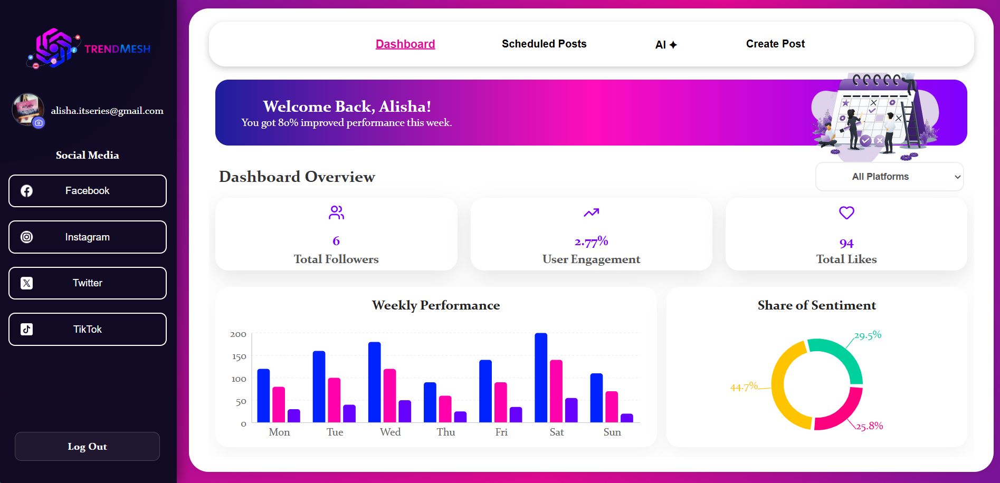
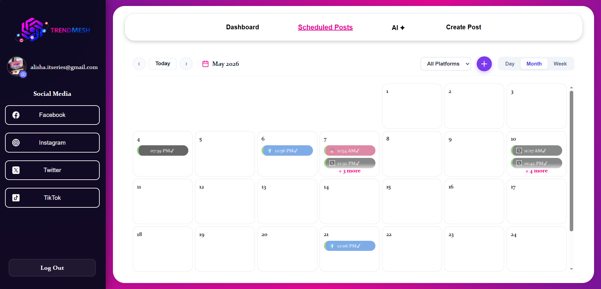
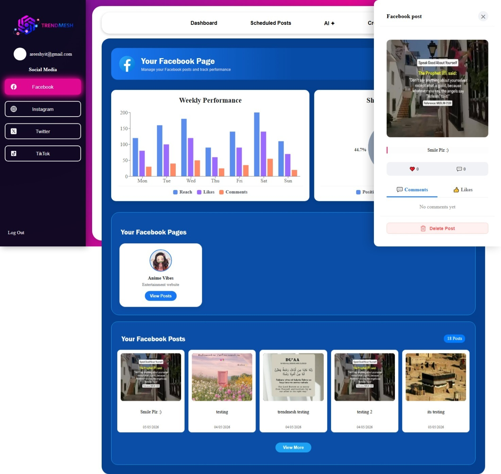
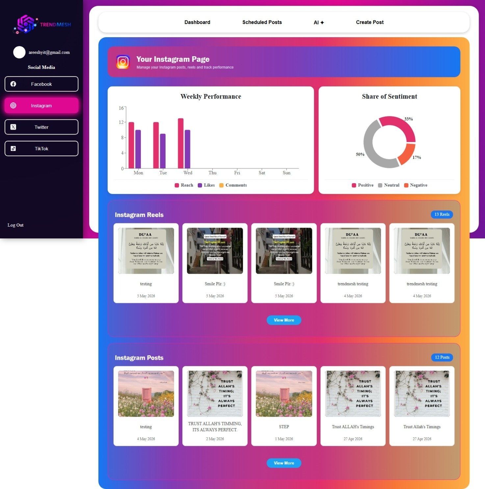
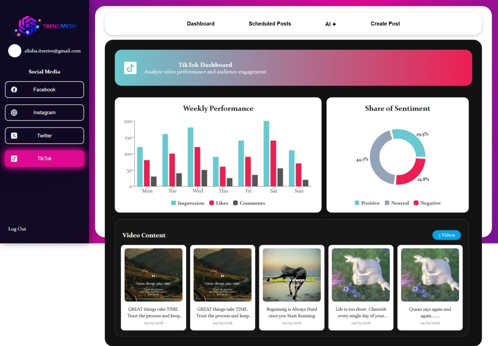
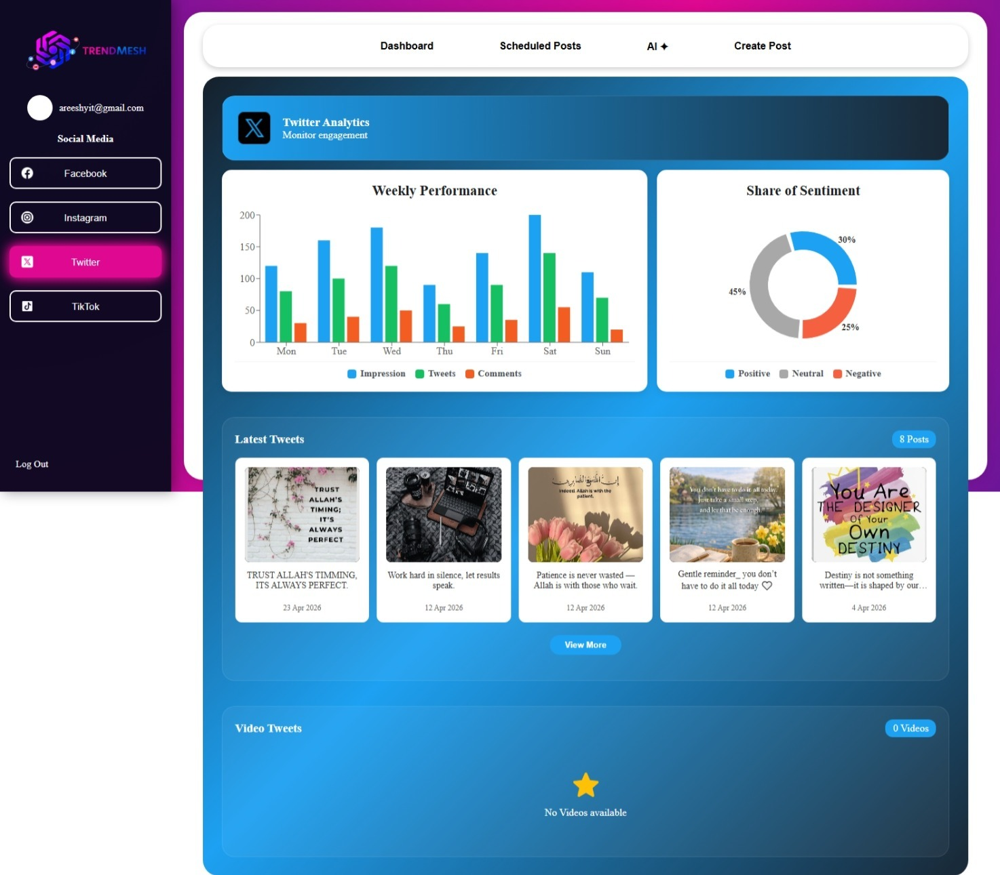
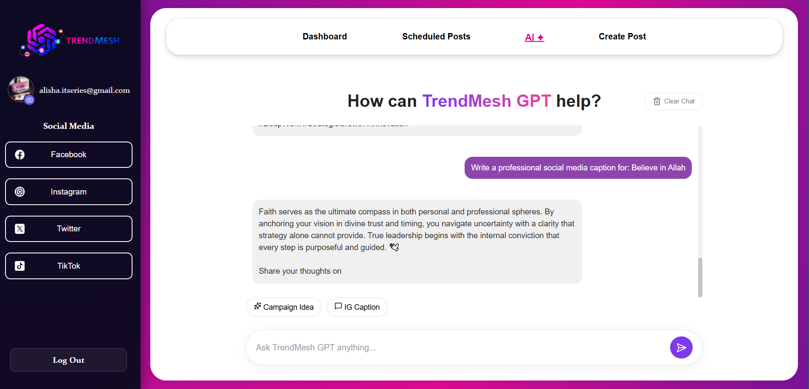

# 🚀 TrendMesh

  
  
  

---

## 📌 Project Overview

**TrendMesh** is a comprehensive, full-stack social media automation and management dashboard designed to streamline digital marketing workflows. It enables businesses and authorized managers to handle cross-platform content scheduling and publishing from a single, unified interface. By integrating robust server-side logic with automated engines, it transforms how brands plan, post, and scale their online presence.

---

## 🎥 System Walkthrough & Demo

  <video src="https://github.com/user-attachments/assets/f0888f78-8198-4047-a06d-e674d9132495" width="85%" controls muted autoplay loop></video>

---

## ✨ Core Features

* **🔐 Multi-Step Authentication:** Secure **Login** and dynamic **Signup** engine restricted to authorized corporate emails.
* **📧 Smart OTP Verification:** Automated 6-digit verification codes powered by **Nodemailer** with a strict 5-minute expiry window.
* **🛡️ Secure Access Control:** Enterprise-grade security utilizing **JSON Web Tokens (JWT)** for session persistence and **Bcryptjs** for advanced password hashing.
* **⏳ Automation Engine & Scheduler:** A smart backend scheduler capable of orchestrating automated content distribution.
* **📊 Unified Analytics Dashboard:** A responsive, fluid central hub that tracks system statuses, scheduling logs, and quick operational insights.
* **🔌 Social API Integrations:** Scalable architecture built to interface with major platforms including **Facebook, Instagram, TikTok, and Twitter**.

---

## 🛠️ Tech Stack & Architecture

| Component | Technology Used |
| :--- | :--- |
| **Frontend UI** | React.js (Fluid & Responsive Layouts) |
| **Backend Framework** | Node.js with Express.js |
| **Database Engine** | MongoDB (via Mongoose ODM) |
| **Email Service** | Nodemailer (SMTP Routing) |
| **Token Handling** | Crypto & JWT (JsonWebToken) |

---

## 📷 System Architecture & UI Preview

<table border="0">
  <tr>
    <td align="center" width="50%"><b>🔐 Secured Access (Login)</b></td>
    <td align="center" width="50%"><b>📝 Enterprise Registration</b></td>
  </tr>
  <tr>
    <td></td>
    <td></td>
  </tr>

  <tr>
    <td align="center"><b>📊 Core Automation Dashboard</b></td>
    <td align="center"><b>⏳ Post Scheduler Module</b></td>
  </tr>
  <tr>
    <td></td>
    <td></td>
  </tr>

  <tr>
    <td align="center"><b>🔵 Facebook Integration</b></td>
    <td align="center"><b>📸 Instagram Dashboard</b></td>
  </tr>
  <tr>
    <td></td>
    <td></td>
  </tr>

  <tr>
    <td align="center"><b>🎵 TikTok Automation Engine</b></td>
    <td align="center"><b>🐦 Twitter / X Feed Module</b></td>
  </tr>
  <tr>
    <td></td>
    <td></td>
  </tr>
  
  <tr>
    <td align="center" colspan="2"><b>🤖 AI Content Generation Insights</b></td>
  </tr>
  <tr>
    <td colspan="2" align="center"></td>
  </tr>
</table>

---
